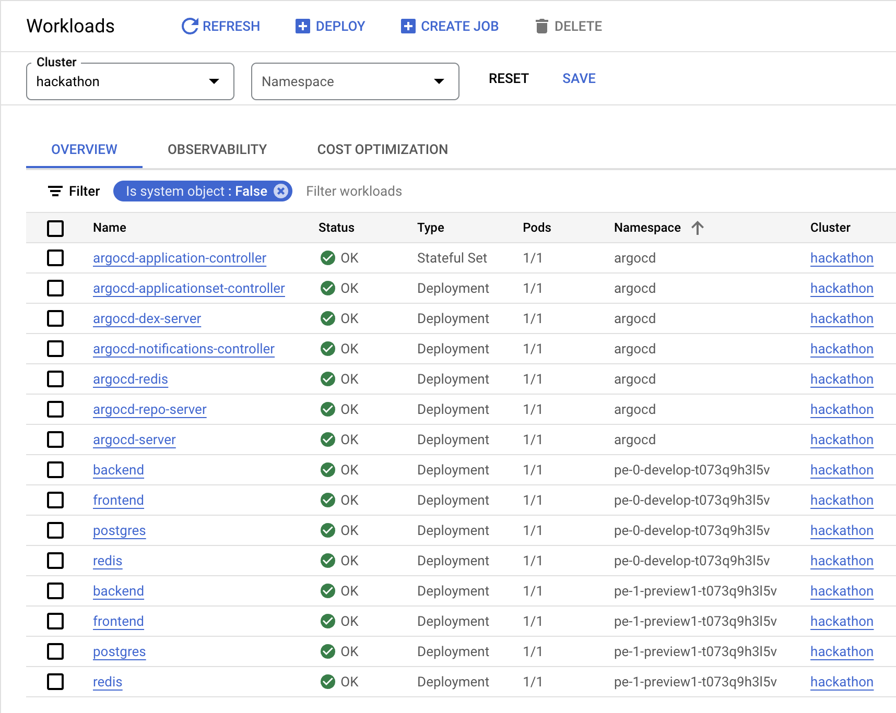
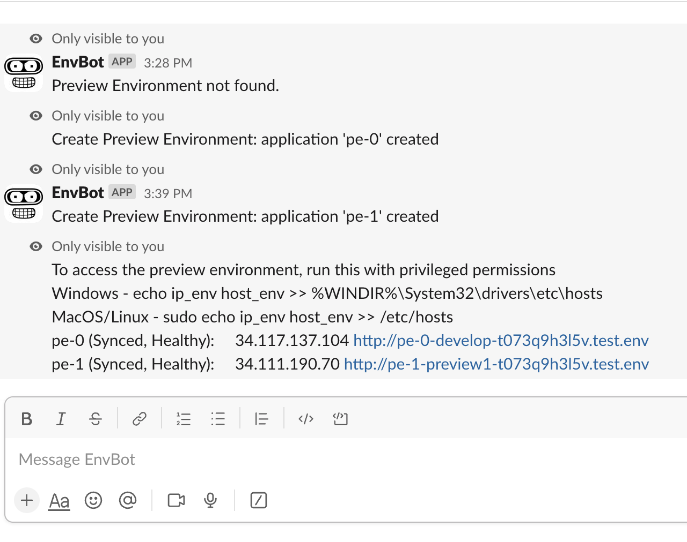

# Automated Preview Environment Management with Slack Bot

## Prepared Infrastructure

**Pic.1: A VM instance for running a bot and nodes of a Kubernetes cluster.**
 
 
 

**Pic.2: A demo Kubernetes cluster.**
 
 
 

**Pic.3: Argo CD components are running.**
 
 
 

**Pic.4: Argo CD web UI shows a clean environment.**

## Making Changes and Creating Preview Environments

**Pic.5: Create a new branch 'preview1' and add changes.**
 
 
 

**Pic.6: Ask the bot to create environments: pe-0 from the 'develop' branch and pe-1 from the 'preview-1' branch.**
 
 
 

**Pic.7: The bot has confirmed the creation of the preview environments.**
 
 
 

**Pic.8: The components of the preview environments are up and running.**
 
 
 

**Pic.9: The Argo CD web UI displaying deployed preview environments.**
 
 
 

**Pic.10: Detailed view of a preview environment in the Argo CD web UI.**

## Preview Environments Access and Functionality Check

**Pic.11: The bot provided a list of the created environments in response to the '/get' command.**
 
 
 

**Pic.12: Preview environment created from the 'develop' branch.**
 
 
 

**Pic.13: Preview environment created from the 'preview1' branch with added changes.**

## Further Changes and Automatic Environment Updates

**Pic.14: Making additional updates in the 'preview1' branch.**
 
 
 

**Pic.15: Docker images are built with each commit to the 'preview' branch.**
 
 
 

**Pic.16: A log entry includes both code changes and version updates.**
 
 
 

**Pic.17: The Argo CD web UI displays the updated 'pe-1' environment with the latest version.**
 
 
 

**Pic.18: Preview environment created from the 'preview1' branch with the latest changes.**

## Deleting Preview Environments

**Pic.19: Sending a message to the bot to delete the 'pe-1' environment.**
 
 
 

**Pic.20: The bot has confirmed the deletion of both preview environments.**
